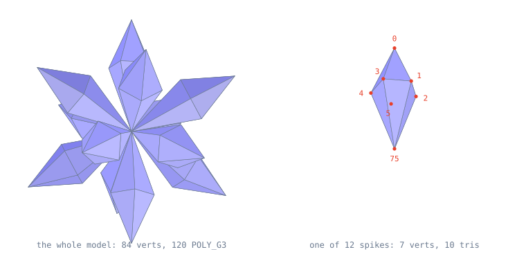

# How a spell is drawn

A walkthrough of `src/magic/brizad.c`, the ice spell, tracing one cast all
the way down to the words that reach the GPU.

Brizad has the smallest code segment of the four magic overlays decompiled so
far: `0x3F0` bytes, against `0xB68` for barrier. In C that is 147 lines and
five functions, one of which is never called. It does once what the others do
several times over, which makes it a good specimen.

Only four are decompiled. The battle engine's magic dispatch table holds 54
entries, so "smallest" above means smallest of what can currently be read, not
smallest in the game. Measured by whole binary rather than code, barrier is
smaller still, because brizad carries more data.

This doc assumes you can read C and nothing else. It explains the PlayStation
parts as it goes. Companion docs: `magic-overlays.md` for the architecture of
the four overlays side by side, `decomp-workflow.md` for the tooling.

---

## 1. The battle clock is 15 frames per second

Every animation length in a spell overlay is a frame count, so the frame rate
is the first thing to pin down.

The battle main loop is `func_800D8A88` in `src/battle/battle3.c`:

```c
int func_800D8A88(void) {
    int ret;

    DrawSync(0);
    ret = VSync(D_800F19A4);
    // flip to the other of the two DB buffers
    g_cDb = (g_cDb == &g_db) ? &g_db + 1 : &g_db;
    g_dbIndex ^= 1;
    return ret;
}
```

`DrawSync(0)` blocks until the GPU has finished the drawing it was given.
`VSync(n)` then blocks until `n` vertical blanking intervals have elapsed.
That second call is the frame limiter, and `D_800F19A4` is its divisor.

The divisor ships in the data segment with a default of 2, at
`asm/us/battle/data/47A38.data.s:12367`:

```
glabel D_800F19A4
    /* 519A4 800F19A4 */ .byte 0x02
```

but battle setup overwrites it before the first frame is drawn, in
`func_800B37EC` at `src/battle/battle1.c:121`:

```c
static void func_800B37EC(void) {
    D_80162094 = 4;
    func_800D8A78(4);        // -> D_800F19A4 = 4
    func_800E15D8();
    func_800D9E0C(-1, -1, 0);
    D_80095DD4 = 2;
}
```

Four NTSC blanks is 4/59.94 of a second, so battle logic advances 14.99 times
per second.

| quantity                          | value  |
|-----------------------------------|--------|
| vertical blanks per battle frame  | 4      |
| NTSC blanks per second            | 59.94  |
| battle frames per second          | 14.99  |
| ice render slot lifetime          | 15     |
| wall clock                        | 1.001s |

The divisor counts frames, not milliseconds. A PAL machine blanks 50 times a
second, so the same 15 frames take 1.2 seconds there. Every animation in the
game runs slower in PAL rather than choppier.

---

## 2. Effect slots, and why effects spawn effects

The battle overlay owns a fixed pool of effect instances:

```c
extern Unk80162978 D_80162978[100];   // battle_private.h
```

One hundred entries, `0x20` bytes each. One entry is one running effect.
The engine exposes three things:

```c
int  BattleEffectRegister(void (*func)(void));
void MagicAnimationRegister(s32 targetMask, s32 arg1, s32 frameStep,
                            void (*func)(int));
void BattleGetPartPosition(s32 target, s32 part, void* out);
```

`BattleEffectRegister` takes a free entry, attaches the callback and returns
the **index**. Once per frame the engine walks the live entries; for each it
writes that entry's index into the global `D_8015169C` and then calls the
callback with no arguments.

So a callback finds its own state like this, and this line opens every
function in the file:

```c
BrizadData* effect = &D_80162978[D_8015169C];
```

There is no `this` pointer. The object identity arrives through a global that
the scheduler sets immediately before the call. A callback retires its slot by
writing `-1` into the first field.

A slot holds exactly one callback, so anything that needs an independent
lifetime needs its own slot. That single constraint is why one cast turns into
a chain of short-lived objects.

### The chain

The overlay entry point is the last function in the file, because its position
in the source is dictated by its ROM address:

```c
void MAGIC_Brizad(s32 targetMask, s32 arg1) {
    BattleEffectRegister(BrizadDoubleBufferFlip);
    MagicAnimationRegister(targetMask, arg1, 4, BrizadAttachToTarget);
    BattleCommandSend(0x20, BattleEntityGetStereoPan((s32)D_80151774), 0x18);
}
```

Three statements: register the buffer flip, hand a per-target callback to the
engine with a step of 4 frames, fire the sound effect. The engine then calls
the attach callback once per target, four frames apart, which is the stagger
you see on a multi-target cast.

```c
static void BrizadAttachToTarget(s32 target) {
    D_80162978[BattleEffectRegister(BrizadSpawnIce)].TargetIndex = target;
}
```

That is the whole function: allocate a slot, stamp the target into it. The
spawn slot then lives a single frame:

```c
static void BrizadSpawnIce(void) {
    BrizadData* next;
    BrizadData* effect = &D_80162978[D_8015169C];

    if (D_80062D98 == 0) {
        if (effect->AnimationFrame == 0) {
            next = &D_80162978[BattleEffectRegister(BrizadRenderIce)];
            BattleGetPartPosition(effect->TargetIndex,
                D_801518E4[effect->TargetIndex].D_8015190F, &next->Pos);
            next->Rot.vz = 0;
            next->Rot.vy = 0;
            next->Rot.vx = 0;
            next->Scale = func_800D55A4(effect->TargetIndex);
            func_800D5774(effect->TargetIndex);
            if (effect->AnimationFrame == 0) {
                effect->StartFrame = -1;
            }
        }
        effect->AnimationFrame++;
    }
}
```

It creates the render slot, asks the engine where on the target's model the
effect belongs, seeds rotation to zero and scale from the target's size, fires
the damage popup, and retires itself. `D_80062D98` is the global pause flag;
every animating slot gates its frame advance on it.

Timeline for one target, in battle frames:

```
frame  0   MAGIC_Brizad, fan-out calls BrizadAttachToTarget
frame  1   BrizadSpawnIce runs once, creates the render slot, retires
frame  2   BrizadRenderIce, animation frame 0    scale 0
  ...
frame 16   BrizadRenderIce, animation frame 14   scale 3x, one full turn
frame 17   slot retired
```

The exact frame each handoff lands on depends on the dispatch loop's order,
which is still assembly and unverified. The 15-frame render life is not.

---

## 3. Fixed point

There is no floating point unit on this machine. Everything is fixed point
with **4096 standing for 1.0**, so a multiply is followed by `>> 12`.

```c
#define FIXED_SHIFT 12
#define FIXED_ONE (1 << FIXED_SHIFT)
```

Angles use the same unit, where 4096 is a **full turn** rather than 360 or two
pi. That makes wrapping free: the angle is a 12-bit field and overflow is a
lap.

Both of brizad's animation constants fall out of the 15-frame lifetime. The
block renders on frames 0 through 14, and frame 0 has zero scale, so there are
14 steps between the first visible frame and the last:

```c
#define BRIZAD_LIFETIME 15
#define GROWTH_PER_FRAME (3 * FIXED_ONE / (BRIZAD_LIFETIME - 1)) // 0x36D
#define FADE_PER_FRAME (FIXED_ONE / (BRIZAD_LIFETIME - 1))       // 0x124
```

`0x36D` times 14, divided by 4096, is 3.0: the block grows to three times the
target's size.

`0x124` times 14 is 4088, which is 4096 less rounding. **This is not a
rotation.** The value is written to the render descriptor's field at offset
`0xA`, and section 10 shows what that field does: it is the depth-cue
interpolation factor, and 4096 means "fully blended into the fog colour".
Since brizad calls `SetFarColor(0, 0, 0)` on the line before, the ramp is a
fade to black over the life of the effect.

That second constant was called `SPIN_PER_FRAME` until this walkthrough, with
a local named `spin` and a file comment claiming the block "spins through
exactly one revolution". All three were wrong. The actual rotation is carried
separately in `effect->Rot`, which stays at zero for the whole animation
because `BrizadSpawnIce` seeds it to zero and nothing ever writes it again.
The ice model does not spin at all. Section 13 has the evidence.

---

## 4. Building the matrix

`BrizadRenderIce` is the only function in the overlay with real graphics
content. Stripped to the transform:

```c
s32 growth = (effect->Scale * GROWTH_PER_FRAME);
s32 scale = (s32)(effect->AnimationFrame * growth) >> FIXED_SHIFT;

if (scale > SCALE_MAX) {          // SCALE_MAX == 0x7FFF
    scale = SCALE_MAX;
}
scaleVec.vx = scaleVec.vy = scaleVec.vz = scale;

RotMatrixYXZ(&effect->Rot, &matrix);
ScaleMatrix(&matrix, &scaleVec);
matrix.t[0] = (s32)effect->Pos.vx;
matrix.t[1] = (s32)effect->Pos.vy;
matrix.t[2] = (s32)effect->Pos.vz;
CompMatrix(&D_800FA63C.m, &matrix, &matrix);
SetRotMatrix(&matrix);
SetTransMatrix(&matrix);
```

Rotate, scale, translate, then compose with the camera to land in view space.
`D_800FA63C` is the camera; `src/battle/battle2.c:942` names it so, and
`battle2.c:1202` loads it directly when drawing in camera space.

The clamp is not cosmetic. A `MATRIX` is:

```c
typedef struct {
    short m[3][3]; // 3 x 3 matrix coefficient value
    long t[3];     // Parallel transfer volume
} MATRIX;          // size = 0x1E
```

The coefficients are **signed 16-bit**. `ScaleMatrix` multiplies the diagonal,
so a scale of `0x7FFF` against an identity entry of `4096` lands exactly on
the ceiling. One more and it wraps negative and the model turns inside out.

---

## 5. What `SetRotMatrix` actually emits

This is where the hardware starts. The Geometry Transformation Engine is
coprocessor 2 on the R3000, and it is driven with real instructions, not a
memory-mapped register block. `include/psxsdk/libgte.h` has the inline forms:

```c
#define gte_SetRotMatrix(r0)                                                   \
    __asm__ volatile(                                                          \
        "lw	$12, 0( %0 );"                                                     \
        "lw	$13, 4( %0 );"                                                     \
        "ctc2	$12, $0;"                                                        \
        "ctc2	$13, $1;"                                                        \
        "lw	$12, 8( %0 );"                                                     \
        "lw	$13, 12( %0 );"                                                    \
        "lw	$14, 16( %0 );"                                                    \
        "ctc2	$12, $2;"                                                        \
        "ctc2	$13, $3;"                                                        \
        "ctc2	$14, $4"                                                         \
        : : "r"(r0) : "$12", "$13", "$14")
```

Five words are read out of the matrix and pushed into GTE **control**
registers 0 through 4 with `ctc2`. Five words is 20 bytes, which covers the
nine 16-bit coefficients packed two to a word:

| control reg | holds       |
|-------------|-------------|
| `cnt0`      | R11, R12    |
| `cnt1`      | R13, R21    |
| `cnt2`      | R22, R23    |
| `cnt3`      | R31, R32    |
| `cnt4`      | R33         |

`SetTransMatrix` is the same idea for the translation column:

```c
#define gte_SetTransMatrix(r0)                                                 \
    __asm__ volatile(                                                          \
        "lw	$12, 20( %0 );"                                                    \
        "lw	$13, 24( %0 );"                                                    \
        "ctc2	$12, $5;"                                                        \
        "lw	$14, 28( %0 );"                                                    \
        "ctc2	$13, $6;"                                                        \
        "ctc2	$14, $7"                                                         \
        : : "r"(r0) : "$12", "$13", "$14")
```

Offsets 20, 24 and 28 are `t[0..2]`, because `m` is 18 bytes and pads to 20.
They land in control registers 5, 6 and 7, which are TRX, TRY and TRZ.

Two consequences follow, and both explain shapes in the C:

- **The GTE holds one matrix at a time.** There is no matrix stack in
  hardware. That is why the pair of `Set*Matrix` calls appears immediately
  before every draw, once per model per frame, rather than once at setup.
- **TRZ is readable.** Control register 7 still holds the object's view-space
  depth after the matrix is loaded, and one of the renderers reads it back to
  pick a depth bucket. More on that in section 8.

---

## 6. Transforming vertices

`SetFarColor(0, 0, 0)` runs just before the draw in brizad. It sets the fog
colour to black, which is what the depth-cue stage blends toward.

The actual vertex work happens inside the render helpers, which are still
hand-written assembly. The pattern, from
`asm/us/battle/nonmatchings/battle2/func_800D4D90.s`:

```
    mtc2       $t0, $0      # VXY0  <- corner 0, x and y packed in one word
    mtc2       $zero, $1    # VZ0   <- 0
    mtc2       $t1, $2      # VXY1  <- corner 1
    mtc2       $zero, $3    # VZ1   <- 0
    mtc2       $t2, $4      # VXY2  <- corner 2
    mtc2       $zero, $5    # VZ2   <- 0
    rtpt                    # transform all three at once
    ...
    mfc2       $t0, $12     # SXY0  -> screen x,y of corner 0
    mfc2       $t1, $13     # SXY1
    mfc2       $t2, $14     # SXY2
```

`mtc2` moves a word into a GTE **data** register; `mfc2` reads one back.
`rtpt` is Rotate, Translate and Perspective transform, Triple: it runs three
vertices through the loaded matrix and the perspective divide in one
instruction. The results come back as packed screen coordinates in data
registers 12, 13 and 14.

The opcode is not in the assembler's vocabulary, so the header spells it as a
literal word:

```c
#define gte_rtpt()                                                             \
    __asm__ volatile("nop;"                                                    \
                     "nop;"                                                    \
                     ".word 0x4A280030")
```

The two `nop`s are not decoration. `mtc2` has a delay before the value is
visible to the coprocessor, and the compiler will not insert the stall for
you.

A quad needs a fourth corner, so the same file does one more single-vertex
transform for it:

```
    mtc2       $t3, $0      # VXY0 <- corner 3
    mtc2       $zero, $1
    nop
    nop
    rtps                    # single-vertex variant
    nop
    nop
    swc2       $14, 0x20($a3)   # SXY2 stored straight into the packet
```

`swc2` stores a coprocessor register directly to memory, so the last result
never passes through a general register at all. It goes from the GTE into the
GPU packet in one instruction.

### The other form: straight from the vertex table

That is the quad builder, which synthesises its corners in general registers
and has to `mtc2` them across. The model renderer brizad uses does not. It has
a real vertex table in memory, so it loads the coprocessor from RAM directly,
at `0x800D2AFC` in `asm/us/battle/nonmatchings/battle2/func_800D29D4.s`:

```
    lwc2  $0, 0x0($t4)     # VXY0 <- vertex A, x and y
    lwc2  $1, 0x4($t4)     # VZ0  <- vertex A, z
    lwc2  $2, 0x0($t5)     # VXY1
    lwc2  $3, 0x4($t5)     # VZ1
    lwc2  $4, 0x0($t6)     # VXY2
    lwc2  $5, 0x4($t6)     # VZ2
    addiu $a0, $a0, 0x10
    rtpt
```

`lwc2` is a load *into* a coprocessor register, the mirror of the `swc2` above.
The vertex data never passes through a general-purpose register at all: it goes
from the model in the overlay's data segment into the GTE in one instruction
per word. That is also why a vertex is 8 bytes with a padding halfword — the
two loads have to be word-aligned and the format has to match `VXY`/`VZ`
exactly.

The three pointers are computed just above it:

```
    lh    $t4, 0x0($a0)    # the record's three vertex indices,
    lh    $t5, 0x2($a0)    # each a byte offset
    lh    $t6, 0x4($a0)
    addu  $t4, $s5, $t4    # $s5 = base of the vertex table
    addu  $t5, $s5, $t5
    addu  $t6, $s5, $t6
```

which is section 11's "byte offsets, not element numbers" seen from the other
side: `addu` with no shift, because the multiply is already baked into the
data.

The GTE data registers used across the battle code:

| data reg  | name        | meaning                                  |
|-----------|-------------|------------------------------------------|
| `0`-`5`   | VXY0..VZ2   | three input vertices                     |
| `6`       | RGBC        | input colour plus GPU command byte       |
| `7`       | OTZ         | average depth of the transformed poly    |
| `8`       | IR0         | interpolation factor, used for fog       |
| `12`-`14` | SXY0..SXY2  | transformed screen coordinates           |
| `19`      | SZ3         | depth of the last vertex                 |
| `22`      | RGB2        | colour after the depth-cue stage         |
| `24`      | MAC0        | accumulator, holds the backface result   |

This is the standard GTE register map, and every entry above is corroborated
by a use somewhere in this repository.

---

## 7. What a GPU primitive actually is

The CPU never touches a pixel. It writes small command packets into a RAM
buffer, and the GPU reads them back and rasterises. A packet is just words,
and `include/psxsdk/libgpu.h` gives their shape. The textured quad, which is
the workhorse of the effect code:

```c
typedef struct {
    O_TAG;                       // 0x00  link word: 24-bit next + 8-bit length
    u_char r0, g0, b0, code;     // 0x04  colour, then the GPU command byte
    short x0, y0;                // 0x08
    u_char u0, v0;               // 0x0C  texture coordinates
    u_short clut;                // 0x0E  palette id
    short x1, y1;                // 0x10
    u_char u1, v1;               // 0x14
    u_short tpage;               // 0x16  texture page
    short x2, y2;                // 0x18
    u_char u2, v2;               // 0x1C
    u_short pad1;                // 0x1E
    short x3, y3;                // 0x20
    u_char u3, v3;               // 0x24
    u_short pad2;                // 0x26
} POLY_FT4;
```

Forty bytes: one tag word plus nine payload words. The header states both
numbers directly:

```c
#define setPolyFT4(p) setlen(p, 9), setcode(p, 0x2c)
```

**A trap worth knowing.** The `// 0x2C` comment sitting after the `POLY_FT4`
struct in that header is the GPU *command byte*, not the struct size. Same for
`// 0x28` on `POLY_F4` and `// 0x38` on `POLY_G4`. The sizes are 40, 40 and
56.

The command byte is a bit field, which is why the numbers look arbitrary until
you split them:

| bit    | meaning              |
|--------|----------------------|
| `0x20` | this is a polygon    |
| `0x10` | Gouraud shaded       |
| `0x08` | four vertices, not 3 |
| `0x04` | textured             |
| `0x02` | semi-transparent     |
| `0x01` | raw texture          |

So `0x2C` is polygon + quad + textured, and `0x38` is polygon + quad +
Gouraud. Setting bit `0x02` on either gives its translucent variant, and that
is exactly how the effect code turns transparency on, one bit at a time.

---

## 8. The ordering table

The console has **no depth buffer**. It cannot test a pixel against what is
already on screen. Instead there is an ordering table: an array of linked-list
heads where the index stands for distance.

The battle table lives in the display buffer struct, `src/battle/battle.h`:

```c
typedef struct {
    /* 0x0000 */ u_long* unk0[0x1C];
    /* 0x0070 */ u_long* unk70[0x1000];    // 4096 depth buckets
    ...
} DB; // size:0x40F4
```

and it is reset each frame in `src/battle/battle1.c:413`:

```c
ClearOTagR((u_long*)g_cDb->unk70, LEN(g_cDb->unk70));
```

The `R` is "reverse": it links each entry to the one below it, so a single
walk starts at the far end and runs toward the camera. **Choosing a bucket is
the sort.** There is no sorting pass anywhere.

Each packet's first word is the link:

```c
typedef struct {
    unsigned addr : 24;
    unsigned len : 8;
} P_TAG;
```

Twenty-four bits of next-packet address, because all of RAM fits in 24 bits,
and eight bits of payload length so the DMA engine knows how many words to
push. Linking a packet in is a two-line macro:

```c
#define addPrim(ot, p) setaddr(p, getaddr(ot)), setaddr(ot, p)
```

Classic push-front on a singly linked list. The hand-written renderer does it
inline, building the length into the same word:

```
    lw    $t0, 0x0($a2)        # old head of this bucket
    and   $t0, $t0, 0xFFFFFF   # keep its 24-bit address
    or    $t0, $t0, 0x9000000  # payload length = 9 words, in the top byte
    sw    $t0, 0x0($a3)        # that word becomes this packet's tag
    and   $v0, $a3, 0xFFFFFF   # this packet's own address
    sw    $v0, 0x0($a2)        # bucket head now points at this packet
```

`0x09000000` is the `setlen(p, 9)` above, written as a constant. The packet
pointer then advances by `0x28`, confirming `POLY_FT4`.

### Where the bucket index comes from

This is the part worth reading twice. `func_800D4D90` picks one bucket for a
whole batch, straight out of the GTE:

```
    cfc2  $v0, $7              # control reg 7 = TRZ, the object's view depth
    addiu $v1, $zero, 0x10     # 16
    sub   $v1, $v1, $a2        # 16 - otLen, and callers pass otLen = 12
    blez  $v0, .L800D4FA0      # depth <= 0 is behind the camera: draw nothing
     srav $v0, $v0, $v1        # TRZ >> 4
    sll   $v0, $v0, 2          # scale to a word index
    add   $a2, $a1, $v0        # &ot[TRZ >> 4]
```

The translation Z that `SetTransMatrix` loaded is still sitting in the
coprocessor, so the depth is free. Sixteen is the width of the depth range and
`otLen` is the **base-2 log of the table size**, so `16 - 12` maps a 16-bit
depth onto a 12-bit index.

That log is a real inconsistency to watch for: `ClearOTagR` above takes the
table's element *count*, `0x1000`, while these renderers take `12`. Same
table, two conventions.

---

## 9. A packet, built word by word

`func_800D4D90` is 149 lines of hand-written assembly and it builds one
`POLY_FT4` per quad. Here is the whole shape, in order.

**Pick the block.** The descriptor's offset `8` is not a count, it is an
index. Bit 15 is a flag; the low bits select which block of the model data
to draw, and the function walks forward over that many blocks to reach it:

```
    lhu   $t8, 0x8($a0)        # u08.frameIndex
    andi  $v0, $t8, 0x8000     # bit 15 selects whether unkA is used
    andi  $t8, $t8, 0x7FFF     # low bits: which block
    lhu   $t7, 0xA($a0)        # unkA, only when bit 15 was set
    lw    $a0, 0x0($a0)        # the model data pointer
    addiu $a0, $a0, 0x8        # skip an 8-byte header
```

Each block is a 4-byte header holding a quad count, followed by that many
20-byte records. The callers corroborate the reading: in `src/magic/thunder.c`
the field ramps with the animation frame, so each frame draws the next block.

```c
ThunderRenderDesc0.u08.frameIndex = (s16)(u16)effect->AnimationFrame >> 1;
ThunderBufferPtr = func_800D4D90(&ThunderRenderDesc0, g_cDb->unk70, 0xC,
                                 ThunderBufferPtr);
```

**Expand four corners from a base and two deltas.** A record stores one corner
and a width and height rather than four points:

```
    lw    $t0, 0x4($a0)                # base corner, x and y packed in one word
    lw    $t1, 0x10($a0)               # deltas
    and   $t2, $t1, 0xFF0000           # height
    andi  $t1, $t1, 0xFF               # width
    and   $t0, $t0, 0x1FFF1FFF         # 13 bits per axis
    sll   $t0, $t0, 3                  # scaled into a 16-bit field
    sll   $t1, $t1, 3
    sll   $t2, $t2, 3
    add   $t1, $t1, $t0                # corner 1 = base + width
    add   $t3, $t1, $t2                # corner 3 = base + width + height
    add   $t2, $t2, $t0                # corner 2 = base + height
```

Two 16-bit coordinates travel in every 32-bit word, which is the same packing
the GTE wants, so they go straight in. That is the `mtc2` and `rtpt` block
from section 6.

**Write the colour and command word:**

```
    andi  $v0, $t6, 0x100      # per-quad flag: semi-transparent
    beqz  $v0, .L800D4F74
     addu $v0, $t9, $zero      # the descriptor's own colour+code word
    lui   $v1, 0x2000000 >> 16
    or    $v0, $v0, $v1        # set bit 25 = bit 1 of the command byte
  .L800D4F74:
    sw    $v0, 0x4($a3)        # -> POLY_FT4.code and rgb0
```

Bit 25 of the word is bit 1 of the command byte, the semi-transparency bit
from section 7. A textured quad at `0x2C` becomes `0x2E`.

**Write the texture coordinates,** with two flip flags:

```
    andi  $v0, $t6, 0x1        # flip horizontally: swap the u range
    andi  $v0, $t6, 0x2        # flip vertically: swap the v range
    sb    $t0, 0xC($a3)        # u0
    sb    $t1, 0xD($a3)        # v0
    sb    $t2, 0x14($a3)       # u1
    sb    $t1, 0x15($a3)       # v1
    sb    $t0, 0x1C($a3)       # u2
    sb    $t3, 0x1D($a3)       # v2
    sb    $t2, 0x24($a3)       # u3
    sb    $t3, 0x25($a3)       # v3
```

Those eight offsets are exactly the `u0` through `v3` fields of `POLY_FT4`.
Mirroring a sprite costs one bit in the record and a register swap.

**Write the palette and texture page:**

```
    lw    $t0, 0xC($a0)
    sh    $t0, 0x16($a3)       # low half  -> tpage
    srl   $t0, $t0, 16
    addu  $t0, $t0, $t7        # + unkA
    sh    $t0, 0xE($a3)        # high half -> clut
```

So in **this** function the descriptor's `unkA` is added to the palette id.
It selects a CLUT, which is how an effect recolours or fades without touching
its geometry.

**Advance and repeat:**

```
    addi  $a0, $a0, 0x14       # next record: 20 bytes
    addi  $a3, $a3, 0x28       # next packet: 40 bytes, POLY_FT4
```

The function returns the advanced packet pointer in `$v0`, which is why every
call site in all four overlays looks like this:

```c
ThunderBufferPtr = func_800D4D90(&desc, g_cDb->unk70, 0xC, ThunderBufferPtr);
```

The primitive buffer is a bump allocator threaded through every draw in the
frame.

---

## 10. The renderer ice actually uses

`func_800D4D90` above is the simpler of the two. Brizad, barrier and thunder's
model pass all go through `func_800D29D4`, which is 609 lines and does a great
deal more. The differences are the interesting part.

**It unpacks the whole descriptor up front.** The first dozen instructions
read every field of `Unk801B0C98` into a saved register and then follow the
pointer, which is the cleanest confirmation of the struct in `battle.h`:

```
    lw    $s0, 0x4($a0)    # desc.u.flags
    lhu   $s1, 0x8($a0)    # desc.u08.uvOffset
    lhu   $s2, 0xA($a0)    # desc.uA.depthCue
    lhu   $s3, 0xC($a0)    # unkC
    lhu   $s4, 0xE($a0)    # unkE
    lw    $a0, 0x0($a0)    # -> the model data
    ...
    lw    $v0, 0x0($a0)    # vertex table size, in bytes
    addiu $s5, $a0, 0x4    # $s5 = base of the vertex table
    addu  $a0, $s5, $v0    # $a0 = first primitive list, just past the table
```

Those three lines at the end *are* the model format from section 11, executed:
a size word, the table, then the lists. `$s5` stays put for the whole call and
`$a0` walks forward through the four lists. `$s3` is later stored to `0x16` of
the textured packets, so `unkC` is a texture-page base; brizad's is `0x20`.

**It emits four primitive types, in four separate passes.** The model data
carries four independent lists and the renderer walks them in a fixed order.
Each pass hard-codes its own tag length and packet stride, and all four agree
with the `setPoly*` macros in `libgpu.h`:

| pass | primitive  | command | tag length | packet size |
|------|------------|---------|------------|-------------|
| 1    | `POLY_FT3` | `0x24`  | 7          | `0x20`      |
| 2    | `POLY_FT4` | `0x2C`  | 9          | `0x28`      |
| 3    | `POLY_G3`  | `0x30`  | 6          | `0x1C`      |
| 4    | `POLY_G4`  | `0x38`  | 8          | `0x24`      |

Passes 3 and 4 never write a command byte at all. The whole colour-and-code
word is copied out of the model data, which is why `0x38FFFFFF` in section 11
works: the data picks the primitive type, the code just copies it through.

**The bucket comes from OTZ, not TRZ.** Where the quad builder read the
object's translation once for the whole batch, this one sorts per primitive:

```
    mfc2  $t0, $7              # data reg 7 = OTZ, the average depth of this poly
    srav  $t0, $t0, $a2        # $a2 was set to 14 - otLen, so >> 2
    sll   $t0, $t0, 2
    addu  $t0, $t0, $a1        # &ot[OTZ >> 2]
```

Note the different constant: `14 - otLen` here against `16 - otLen` in the
sibling, and a data register rather than a control register. Two renderers,
two depth conventions, same table. There is also no lower bound test here,
so keeping the index inside the table is the caller's problem.

**It culls backfaces.** After transforming the vertices it runs `nclip`, which
computes the sign of the screen-space cross product, and reads the result out
of the accumulator:

```
    andi  $v0, $s0, 0x20       # flag 0x20 disables culling
    bnez  $v0, <emit>
    mfc2  $v0, $24             # MAC0 = the nclip cross product
    beqz  $v0, ...
     xor  $v0, $v0, $s6        # $s6 flips the test when the model is mirrored
    bltz  $v0, <reject>
```

The `xor` is the clever part. Flags `0x1`, `0x2` and `0x4` negate a column of
the rotation matrix to mirror the model on an axis, and each one toggles
`$s6`. An odd number of mirrors reverses the winding of every polygon, so the
sign test has to invert with it.

**It reads the screen coordinates back and links the packet.** This is the
whole hand-off, at `0x800D2B70`, and it is worth reading beside the `POLY_FT3`
layout in section 7:

```
    mfc2  $t0, $12             # SXY0
    mfc2  $t1, $13             # SXY1
    mfc2  $t2, $14             # SXY2
    jal   func_800D32B4        # off-screen reject
    sw    $t0, 0x8($a3)        # -> x0,y0
    sw    $t1, 0x10($a3)       # -> x1,y1
    sw    $t2, 0x18($a3)       # -> x2,y2
    avsz3                      # average the three depths
    mfc2  $t0, $7              # OTZ
    srav  $t0, $t0, $a2        # >> 2
    sll   $t0, $t0, 2
    addu  $t0, $t0, $a1        # &ot[OTZ >> 2]
    lw    $t1, 0x0($t0)        # old head of that bucket
    and   $t1, $t1, 0xFFFFFF
    or    $t1, $t1, 0x7000000  # payload length 7 words = POLY_FT3
    sw    $t1, 0x0($a3)        # this packet's tag
    and   $v0, $a3, 0xFFFFFF
    sw    $v0, 0x0($t0)        # bucket head now points here
```

`$a3` is the packet cursor, which is the fourth argument — the overlay's own
`BrizadBufferPtr`. So a vertex enters the GTE as model-space `s16`s and leaves
it as packed screen coordinates written straight into the primitive page; the
GPU is never shown a vertex, only a packet.

**It does the fade.** This is what `SetFarColor(0, 0, 0)` was for. The GTE has
depth-cue instructions that blend a colour toward the far colour:

```
    mtc2  $v1, $8              # IR0 = the descriptor's field at 0xA
    mtc2  $v0, $6              # RGBC = the colour, plus the command byte
    dpcs                       # colour += (FarColour - colour) * IR0 / 4096
    mfc2  $v0, $22             # RGB2 = the result
```

So `IR0` at 0 leaves the colour alone and `IR0` at 4096 replaces it entirely
with the far colour. The Gouraud passes use `dpct` instead, which runs the
same blend across the whole three-entry colour FIFO in one instruction.

**Which settles what offset `0xA` means.** It is the `IR0` fed to that blend.
Barrier makes it unmistakable, at `src/magic/barrier.c:95`:

```c
var_s3 = barrier->FaceIndex | 8;      // 8 = semi-transparent
var_s4 = temp_a0 << 9;                // 0, 0x200, 0x400 ... 0xE00
...
SetFarColor(0, 0, 0);
...
BorderRenderDesc.desc.u.flags = var_s3 | 0x80;
BorderRenderDesc.desc.unkA = var_s4;
```

Over the effect's last eight frames it turns on transparency and ramps the
field from zero to `0xE00` with the far colour black. That is a fade-out, and
the model's own rotation is already handled by `RotMatrixYXZ` further up the
same function.

Brizad's descriptor confirms it from the other side. Its flag word, read out
of the overlay's data segment, is `0x00000088`: bit `0x08` for
semi-transparency and bit `0x80` for the depth-cued path. Its `0x124` per
frame ramps `IR0` from zero to 4088 across the animation. The ice model grows
to just under three times size while fading to black, and never turns.

**"Fading to black" is only half the mechanism.** On screen a spell does not
darken into a black shape, it disappears -- and both halves of that are in
the same statement. The depth cue drives the vertex colour to the far colour,
and the `0x08` flag makes the primitive semi-transparent, so the colour that
reaches the GPU is blended with what is already in the framebuffer.

Under additive blending a black source contributes nothing, which is exactly
a fade-out. Under the averaging mode it would instead smear a dark shape over
the background, which is not what the game does.

**Measured, on a real cast of Ice.** `tools/blend_probe.py` walked the
ordering table on all 15 frames of the animation:

| observation | count |
| --- | --- |
| texpage fields, every one rate `1` (`B+F`) | 218 |
| standalone `0xE1` draw-mode commands | 0 |
| brizad's own packets, every one code `0x32` | 821 |

`0x32` is `0x30` (Gouraud triangle) plus the `0x02` semi-transparency bit, so
every primitive the spell emits is translucent, on every frame it draws. The
rate is additive and nothing in the scene sets a competing one. The fade to
black is a fade to nothing.

One qualification. An untextured primitive has no texpage of its own, so it
inherits whatever the last one set. That the rate is `B+F` at the moment
these polygons draw follows from `1` being the only value present anywhere in
the table, not from reading the GPU at each draw.

Two things not to over-read. The `0x08` flag is dropped on depth-cued
`POLY_FT4` primitives, described in section 13, so this applies to the
Gouraud model passes and not to the textured-quad path. And the far colour is
per-cast state: it is black here only because these overlays call
`SetFarColor(0, 0, 0)` before drawing. `lv5deth.c` drives the battle far
colour for the whole battlefield instead, and darkening really is what it
wants.

---

## 11. Real model data, annotated

`barrier.c` is the one overlay that brought its data segment into C, so you
can read an actual model. This is the border effect, six vertices and six
primitives:

```c
static s32 bari_a1[] = {
    0x00000030,             // vertex data size: 6 verts x 8 bytes
    0xFE0C0000, 0x000001CA, // (-500, 0, 458, 0)
    0x00000000, 0x0000FFD7, // (0, 0, -41, 0)
    0x0000FE0C, 0x000002E5, // (-500, 0, 741, 0)
    0xFFEDFE2F, 0x000002C2, // (-19, -465, 706, 0)
    0xFE2AFFF2, 0x000001C2, // (-470, -14, 450, 0)
    0xFFEDFFF2, 0x00000000, // (-19, -14, 0, 0)
    0x00200000, 0x00000000, 0x00000000,
    0x00000006,             // number of primitives

    // vertex index pairs, byte offsets into the vertex table
    0x00280008,
    0x00180010,
    // GPU command 0x38 in the top byte, then per-vertex colours
    0x38FFFFFF, 0x006A6A6A, 0x00C0C0C0, 0x006A6A6A,
    ...
```

Every primitive record carries **the GPU command byte inline**, in the top
byte of its first colour word. `0x38FFFFFF` is `POLY_G4`, a Gouraud quad, with
the first vertex white. The three words after it are the other three vertex
colours. The renderer copies that byte through into the packet, so the model
data chooses its own primitive type.

The sibling model uses triangles, and the command changes to match:

```c
    0x303F3F3F, // command 0x30, POLY_G3, RGB 3F3F3F
    0x003F3F3F, // vertex 1 colour
    0x00D4D4D4, // vertex 2 colour
```

`0x30` is polygon + Gouraud with the quad bit clear, and it carries three
colours instead of four. Six words of payload, which is exactly
`setPolyG3(p) setlen(p, 6), setcode(p, 0x30)` from the header.

Vertices are indexed as **byte offsets**, not element numbers: `0x28` is
vertex 5 because each vertex is 8 bytes. The renderer adds the offset to the
table base with no multiply.

### The four lists

Section 10 said the renderer walks four primitive lists. You can see all four
in this data, and counting the words settles the format:

```
+0x00   s32   size of the vertex table in bytes
+0x04   ...   the vertex table, 8 bytes per vertex
        u16   count of POLY_FT3 records   u16 tpage base
        ...   that many 0x10-byte records
        u32   count of POLY_FT4 records
        ...   that many 0x14-byte records
        u16   count of POLY_G3 records    u16 unread
        ...   that many 0x14-byte records
        u32   count of POLY_G4 records
        ...   that many 0x18-byte records
```

Check it against the shield model, which is the smaller of the two:

```c
static s32 bari_a2[] = {
    0x00000018,             // 3 vertices
    0xFFEDFE2F, 0x000002C2,
    0xFE2AFFF2, 0x000001C2,
    0xFFEDFFF2, 0x00000000,
    0x00200000,             // FT3 count 0, tpage 0x20
    0x00000000,             // FT4 count 0
    0x00000002,             // G3 count 2
    0x00000008, 0x00000010, 0x303F3F3F, 0x003F3F3F, 0x00D4D4D4,  // 0x14 bytes
    0x00100008, 0x00000000, 0x303F3F3F, 0x00D4D4D4, 0x003F3F3F}; // 0x14 bytes
static int emptyPoly = 0x00000000;
```

Two Gouraud triangles of exactly `0x14` bytes each, and three zero counts for
the lists this model does not use.

That last line is the payoff. `emptyPoly` is not a stray global: it is the
**fourth count word**, the one that says there are no Gouraud quads. It has to
sit immediately after the array in memory, so it is declared immediately after
it in the source. The border model does the same thing in reverse, opening
with three zero counts before its six Gouraud quads.

### Brizad's own model, still in the data segment

Barrier's model is readable because someone typed it into C. Brizad's is not.
The overlay only names the descriptor, at `src/magic/brizad.c:48`:

```c
extern Unk801B0C98 BrizadRenderDesc;
```

`extern` with no definition anywhere in `src/` means the symbol is resolved out
of the raw data blob. `build/us/brizad.yaml` shows the split:

```yaml
  subsegments:
  - - 0
    - c
    - brizad          # code, file offset 0      -> 0x801B0000
  - - 1008
    - data
    - brizad          # data, file offset 0x3F0  -> 0x801B03F0
  - - 4116
    - .bss
    - brizad          #                             0x801B1014
```

So everything between the end of the code and `0x801B1014` is data, and
`config/symbols.magic-brizad.us.txt` brackets it without naming any of it:

```
MAGIC_Brizad = 0x801B037C;
BrizadRenderDesc = 0x801B1004; // size:0x10
BrizadPrimBuffer = 0x801B1014;
```

The model is the unnamed `0xC14` bytes in between. Dumping it against the
format above, with the same annotation style as `bari_a1`:

```c
// 0x801B03F0, not yet in C. If it were, it would read:
static s32 brizad_model[] = {
    0x000002A0,             // vertex table: 672 bytes = 84 verts x 8
    0x02490000, 0x00000000, // vert  0: (0, 585, 0)
    0x0152006E, 0x0000FFDD, // vert  1: (110, 338, -35)
    0x01520044, 0x0000005D, // vert  2: (68, 338, 93)
    0x01520000, 0x0000FF8D, // vert  3: (0, 338, -115)
    /* ... 80 more ... */

    0x00200000,             // 0x801B0694  FT3 count 0, tpage 0x20
    0x00000000,             // 0x801B0698  FT4 count 0
    0x00000078,             // 0x801B069C  G3  count 120

    0x010000F8, 0x000000F0, // verts 0xF8, 0x100, 0xF0 -> 31, 32, 30
    0x30E76161,             // POLY_G3, rgb 61/61/E7 -- ice blue
    0x00FFB2B2, 0x00FFCFCF, // the other two vertex colours
    0x00F80108, 0x000000F0,
    0x30FFD3D3, 0x00E76161, 0x00FFCFCF,
    /* ... 118 more, 0x14 bytes each ... */

    0x00000000};            // 0x801B1000  G4 count 0
```

**84 vertices, 120 Gouraud triangles, no textures.** Three of the four lists
are empty, so the ice model only ever exercises pass 3 of the renderer. The
colour bytes read `r=0x61, g=0x61, b=0xE7` in memory order, which is the blue
the whole model is tinted with before the depth cue starts pulling it to
black.

### What the ice block actually is

Plotting those 84 vertices settles what the effect looks like, which no amount
of reading the render path will tell you:



It is not a block. It is a **twelve-spike burst**, and the 120 triangles fall
into twelve identical pieces of ten, one per spike, with no vertex shared
between them. Each spike is a pentagonal bipyramid: an outer tip at radius
585, a pentagon ring at radius 357, and a point at the model origin, giving
five triangles out to the tip and five back to the centre.

```
vertex   coordinate       role
  0      (0, 585, 0)      the tip
  1      (110, 338, -35)  \
  2      (68, 338, 93)     |
  3      (0, 338, -115)    |  pentagon ring, 338 out
  4      (-110, 338, -35)  |
  5      (-68, 338, 93)   /
 75      (0, 0, 0)         the model origin
```

The twelve tips all sit within a unit of radius 585, and the angles between
them come out as thirty pairs at 63.4°, thirty at 116.6° and six at 180°.
That is exactly the icosahedron vertex figure — its adjacent-vertex angle is
`arccos(1/sqrt 5)` = 63.43° — so the spikes point at the twelve vertices of an
icosahedron. That is why section 3's growth ramp reads the way it does: the
model is authored at a fixed radius and `func_800D55A4` scales it to the
target, so "three times the target's size" is a sphere of spikes swelling
through it, not a cube.

One quirk falls out of the plot. Vertices `72` through `83` are twelve
identical copies of `(0, 0, 0)`. The spikes are vertex-disjoint, so each one
carries its own centre point rather than sharing a single index — which is
also why the piece in the right-hand panel is numbered `0..5` and then jumps
to `75`.

The figure is generated, not drawn, by `tools/dump_model.py`:

```shell
.venv/bin/python3 tools/dump_model.py disks/us/MAGIC/BRIZAD.BIN \
    docs/brizad-model.svg
```

It parses the format above straight out of the ROM, so it will drift if the
reading of the format is ever wrong. Two honest caveats about the picture:
faces are sorted back-to-front and filled flat with the average of their three
Gouraud colours, because SVG has no Gouraud triangle; and it is drawn in model
space, before the depth cue that fades the whole thing to black.

The last count word lands at `0x801B1000` and the descriptor begins on the
very next word, which is how you know the dump is right:

```c
// 0x801B1004, in the same never-typed data segment:
//   { { brizad_model, .flags = 0x88, .uvOffset = 0, .depthCue = 0 }, 0x20 }
```

Compare barrier, which does have it in C at `src/magic/barrier.c:71`:

```c
static Unk801B0C98 BorderRenderDesc = {{bari_a1, {0}, 0, 0}, 0x20};
```

Same shape, same trailing `0x20`. And the type it fills, from
`src/battle/battle.h`, is what section 10's prologue reads field by field:

```c
typedef struct {
    /* 0x0 */ ModelRenderDesc desc;   // model pointer, flags, uv, depth cue
    /* 0xC */ s16 unkC;
    /* 0xE */ s16 unkE;
} Unk801B0C98; // size:0x10
```

### The whole path, in six addresses

Putting sections 4 through 11 in order, for one triangle of the ice model:

| step         | where          | what                                    |
|--------------|----------------|-----------------------------------------|
| model data   | `0x801B03F0`   | 84 verts, 120 `POLY_G3` records         |
| the handle   | `0x801B1004`   | `BrizadRenderDesc`: pointer + flags     |
| into the GTE | `0x800D2AFC`   | `lwc2 $0..$5` from the table, then `rtpt` |
| out of it    | `0x800D2B70`   | `mfc2 $12..$14` into the packet         |
| the packet   | `0x801B1014`   | `BrizadPrimBuffer`, two 64 KB pages     |
| the sort     | `g_cDb->unk70` | linked into `ot[OTZ >> 2]`              |

`BrizadRenderIce` itself only supplies the first two and the matrix. Line 86 is
the entire draw:

```c
BrizadBufferPtr = func_800D29D4(&BrizadRenderDesc, g_cDb->unk70, 12,
                                BrizadBufferPtr);
```

Descriptor, ordering table, `otLen`, and the bump pointer in and out.

---

## 12. Two pages, and the hand-off

Back in the overlay, the buffer is doubled:

```c
#define BRIZAD_PAGE_SIZE 0x10000

static char BrizadPrimBuffer[2 * BRIZAD_PAGE_SIZE];
static void* BrizadBufferPtr;
```

The declaration order matters. The pointer has to land immediately after the
buffer in `.bss` for the addresses to match the original.

The flip slot is registered first, so it runs before any render slot each
frame:

```c
static void BrizadDoubleBufferFlip(void) {
    BrizadData* flip = &D_80162978[D_8015169C];

    BrizadBufferPtr = flip->AnimationFrame * BRIZAD_PAGE_SIZE + BrizadPrimBuffer;
    flip->AnimationFrame = (u16)flip->AnimationFrame ^ 1;
    if (D_80162080 < 2) {
        flip->StartFrame = -1;
    }
}
```

This slot never animates, so it reuses `AnimationFrame` as a 0/1 page index.
Point the write pointer at this frame's page, toggle to the other one, and
retire when the battle is ending. All three overlays contain this function
essentially unchanged.

So two independent double buffers turn over once per battle frame: the
overlay's own primitive pages, flipped here, and the display buffer struct
holding the ordering table, flipped by the battle loop in section 1. While the
CPU fills one pair, the GPU is reading the other.

---

## 13. Names this doc contradicts

Writing this turned up a guessed name that has spread, which is worth
recording because it is exactly the failure mode the naming rule exists to
prevent.

**Descriptor offset `0xA` is not a rotation.** `magic-overlays.md` describes
the render descriptor as "model pointer at `0x0`, flags at `0x4`, rotation at
`0xA`". Section 10 shows offset `0xA` reaching the GTE as `IR0`, the
depth-cue interpolation factor, and nothing in either renderer performs a
rotation of any kind. Three independent lines of evidence agree:

- `func_800D29D4` moves the field into `IR0` and runs `dpcs` or `dpct`. There
  is no angle table, no trigonometry and no call to any `RotMatrix` variant
  anywhere in it.
- `barrier.c` ramps it from zero to `0xE00` over the effect's last eight
  frames, with the far colour black and semi-transparency switched on in the
  same statement. That is a fade-out.
- Brizad's own descriptor carries flags `0x88`, which selects the depth-cued
  path, and it ramps the field to 4096 over the animation.

The knock-on was inside `brizad.c` itself: `SPIN_PER_FRAME`, the local named
`spin`, and the comment claiming the effect "spins through exactly one
revolution" all described something that does not happen. `effect->Rot` is
seeded to zero by `BrizadSpawnIce` and never written again, so the ice model
has no rotation at all.

Those three are now `FADE_PER_FRAME`, `fade`, and a comment naming the
depth-cue blend. A local and a macro cannot reach the binary, but `make build`
was run anyway and `brizad.exe` still reports `OK`.

**A related trap in the same field.** `func_800D4D90` also reads offset `0xA`,
but as a CLUT addend, and only when bit 15 of offset `8` is set. The same
offset means different things to the two renderers, so a struct field name
covering both would be a fiction either way.

---

## 14. What this doc does not know

Honesty about the edges, since the parts still in assembly are the parts most
likely to be misdescribed.

- **The dispatch loop is assembly.** The once-per-frame contract in section 2
  is inferred from every call site, not read from the scheduler. It is
  unambiguous, but the loop's own ordering rules are unverified.
- **The submission point in battle is not decompiled.** `DrawOTag` is called
  from the title screen, the save menu and the ending, but nothing in the
  battle module calls it in either C or assembly. How the battle ordering
  table reaches the GPU has not been traced here.
- **The off-screen reject bounds are unexplained.** The helper that rejects
  primitives entirely outside the screen tests X against 320 and Y against
  166. The 320 is the display width. The 166 has not been matched to anything.
- **Where the semi-transparency rate comes from is only half-traced.** It is
  measured as additive in section 10, but no magic overlay sets it and no
  draw-mode command carries it: it arrives on the texpage field of textured
  primitives belonging to other passes entirely. What writes those, and
  whether anything could ever set a different rate mid-scene, has not been
  followed.
- **`QuadCount` was named after the wrong function.** In `func_800D4D90` the
  field selects a block of animation. In `func_800D29D4` it is added to every
  texture coordinate instead, making it a UV offset. No caller of the latter
  sets it to anything but zero, so that reading rests on the assembly alone.
  It is now the union `u08` of `frameIndex` and `uvOffset`, and offset `0xA`
  likewise splits into `depthCue`, `greyLevel` and `clutBias`.

- **One instruction looks like a mistake in the original.** In
  `func_800D29D4`, three of the four passes OR the descriptor's colour
  modifiers in from `$s2`. The textured-quad pass uses `$s1` instead. `$s1` is
  loaded with `lhu` and then shifted right by 16, so that expression is always
  zero, and the `0x8` semi-transparency bit is dropped on depth-cued
  `POLY_FT4` primitives. The register encodings differ by one bit, which is
  what a typo in hand-written assembly looks like. This has **not** been
  confirmed against the running game, and it must not be "fixed": the
  overlay's checksum is the specification, so the instruction stays exactly as
  it is whether or not the original author meant it.

A note on citations: `asm/` is gitignored and produced by extraction, so the
line numbers quoted here are reproducible rather than committed.

---

## Appendix: the unused twin

The file contains a byte-identical copy of the per-target callback that
nothing ever registers:

```c
static void BrizadAttachToTargetUnused(s32 target) {
    D_80162978[BattleEffectRegister(BrizadSpawnIce)].TargetIndex = target;
}
```

It was in the original binary. Deleting it shifts every address after it and
breaks the match, so it stays. Codegen is the specification.
